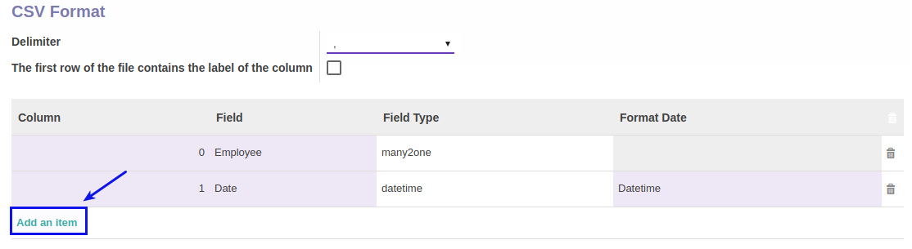

# Membuat CSV Format

*(Instruksi kerja ini merupakan sub instruksi dari (1) [Membuat Attendance Machine](./membuat.md), atau (2) [Memodifikasi Attendance Machine](./memodifikasi.md). Instruksi kerja ini tidak bisa berdiri sendiri)*

## A. INPUT

*(Tidak ada prasyarat khusus)*

## B. INSTRUKSI KERJA

1. Buka tabel **CSV Format**.
2. <a name="l2">Klik</a> tombol **Add an Item** pada tabel **CSV Format**.

4. Isi **[Column](./penjelasan.md#field-column)**. Harus Diisi
5. Pilih **[Field](./penjelasan.md#field-fieldname)**. Harus Diisi
6. Isi **[Field Type](./penjelasan.md#field-fieldtype)**. Harus Diisi
7. Pilih **[Format Date](./penjelasan.md#field-formatdate)** jika item 6 adalah datetime. Harus Diisi
8. Ulangi [langkah ke-2](#l2) untuk menambahkan csv format.
9. Lanjutkan [langkah ke-8 instruksi Membuat Attendance Machine](./membuat.md#tabcsv) atau [langkah ke-9 instruksi Memodifikasi Attendance Machine](./memodifikasi.md#tabcsv).

## C. OUTPUT

*(Tidak ada instruksi khusus)*
