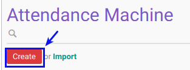

# Membuat Attendance Machine

## A. INPUT

*(Tidak ada instruksi khusus)*

## B. LANGKAH KERJA

1. Buka menu **Human Resource -> Configuration -> Attendance -> Attendance Machine**. Abaikan jika sudah berada pada menu yang dimaksud.
2. Klik tombol **Create** pada bagian atas-kiri form.

3. Isi **[Name](./penjelasan.md#field-name)**. Harus diisi.
4. Buka **Tab CSV Detail**
5. Date/time Format
- Isi **[Date Format](./penjelasan.md#field-date-format)**. Harus diisi.
- Isi **[Time Format](./penjelasan.md#field-time-format)**. Harus diisi.
6. Sign In/out Code
- Isi **[Sign In Code](./penjelasan.md#field-sign-in-code)**. Tidak Harus diisi.
- Isi **[Sign Out Code](./penjelasan.md#field-sign-out-code)**. Tidak Harus diisi.
7. CSV format
- Pilih **[Delimeter](./penjelasan.md#field-delimiter)**. Harus diisi.
- Centang **[The first row of the file contains the label of the column](./penjelasan.md#field-first-row-header)** jika diperlukan.
8. Buka **Tabel CSV Format**
- <a name="tabcsv">[Tambahkan](./membuat-csv.md)/[Modifikasi](./memodifikasi-csv.md)/[Hapus](./menghapus-csv.md)</a>  **Tabel CSV Format**.
9. Buka **Tab Employee code**
- . <a name="tabemployee">[Tambahkan](./membuat-employee-code.md)/[Modifikasi](./memodifikasi-employee-code.md)/[Hapus](./menghapus-employee-code.md)</a>  **Employee Code**.
10. Jika akan **disimpan** Klik tombol **Save** pada bagian atas-kiri form.

## C. OUTPUT

*(Tidak ada instruksi khusus)*
