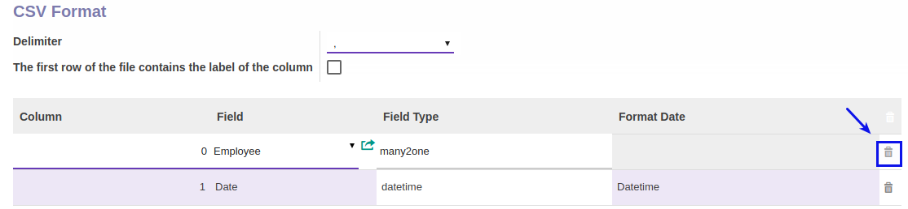

# Menghapus CSV Format

*(Instruksi kerja ini merupakan sub instruksi dari (1) [Membuat Attendance Machine](./membuat.md), atau (2) [Memodifikasi Attendance Machine](./memodifikasi.md). Instruksi kerja ini tidak bisa berdiri sendiri)*

## A. INPUT

*(Tidak ada prasyarat khusus)*

## B. INSTRUKSI KERJA

1. Buka tabel **CSV Format**.
2. <a name="l2">Cari</a> data yang akan dihapus pada tabel **CSV Format**.
3. Klik tombol **Hapus (Gambar Tong Sampah)** pada tabel **CSV Format**.

4. Ulangi [langkah ke-2](#l2) untuk menghapus csv format.
5. Lanjutkan [langkah ke-8 instruksi Membuat Attendance Machine](./membuat.md#tabcsv) atau [langkah ke-9 instruksi Memodifikasi Attendance Machine](./memodifikasi.md#tabcsv).

## C. OUTPUT

* Data **csv format**  akan terhapus
