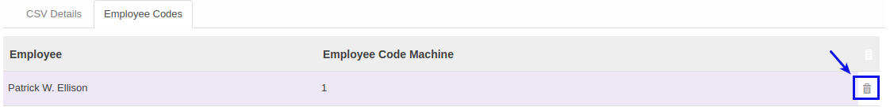

# Menghapus Employee Code

*(Instruksi kerja ini merupakan sub instruksi dari (1) [Membuat Attendance Machine](./membuat.md), atau (2) [Memodifikasi Attendance Machine](./memodifikasi.md). Instruksi kerja ini tidak bisa berdiri sendiri)*

## A. INPUT

*(Tidak ada prasyarat khusus)*

## B. INSTRUKSI KERJA

1. Buka tab **Employee Code**.
2. <a name="l2">Cari</a> data yang akan dihapus pada tabel **Employee Code**.
3. Klik tombol **Hapus (Gambar Tong Sampah)** pada tabel **Employee Code**.

4. Ulangi [langkah ke-2](#l2) untuk menambahkan employee code.
5. Lanjutkan [langkah ke-9 instruksi Membuat Attendance Machine](./membuat.md#tabemployee) atau [langkah ke-10 instruksi Memodifikasi Attendance Machine](./memodifikasi.md#tabemployee).

## C. OUTPUT

*(Tidak ada instruksi khusus)*
