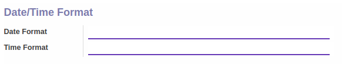
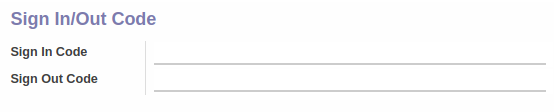
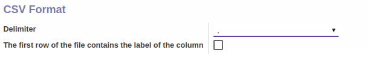
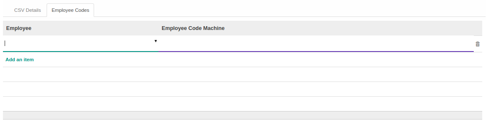

# Penjelasan

Informasi pada Job Family Grade dibagi menjadi beberapa area, diantaranya:

* [Header](#bagian-header)
* [Tab CSV Details](#tab-csv-details)
* [Tab Employee Codes](#tab-employee-code)

### <a name="bagian-header">HEADER</a>

#### <a name="field-name">Name</a>

Nama mesin absen yang dipakai

### <a name="tab-csv-details">TAB CSV DETAILS</a>

### <a name="tab-csv-details-date-time-format">Date/Time Format</a>

#### <a name="field-date-format">Date Format</a>

Format tanggal yang dipakai file CSV
> **Contoh:** %d/%m/%Y

#### <a name="field-time-format">Time Format</a>

Format waktu yang dipakai file CSV
> **Contoh:** %H:%M

### <a name="tab-csv-details-sign-in-out-code">Sign In/Out Code</a>

#### <a name="field-sign-in-code">Sign In Code</a>

Kode sign in yang dipakai file CSV untuk merujuk pada status absen *Sign In*

#### <a name="field-sign-out-code">Sign Out Code</a>

Kode sign out yang dipakai file CSV untuk merujuk pada status absen *Sign Out*

### <a name="tab-csv-details-csv-format">CSV Format</a>

#### <a name="field-delimiter">Delimiter</a>

Dilimiter yang digunakan file CSV

#### <a name="field-first-row-header">The first row of the file contains the label of the column</a>

Jika dicentang, maka file CSV memiliki header pada baris pertama

### <a name="tab-employee-code">TAB EMPLOYEE CODES</a>

#### <a name="field-employee-id">Employee</a>

Mendefinisikan karyawan

#### <a name="field-employee-machine-id">Employee Code Machine</a>

Mendefinisikan kode karyawan yang dipakai mesin absen
