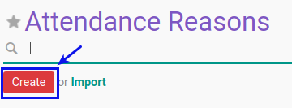

# Membuat Attendance Reason

## A. INPUT

*(Tidak ada instruksi khusus)*

## B. LANGKAH KERJA

1. Buka menu **Human Resource -> Configuration -> Attendance -> Attendance Reason**. Abaikan jika sudah berada pada menu yang dimaksud.
2. Klik tombol **Create** pada bagian atas-kiri form.

3. Isi **[Reason](./penjelasan.md#field-name)**. Harus diisi.
4. Pilih **[Action Type](./penjelasan.md#field-action)**. Tidak harus diisi
5. Jika akan **disimpan** Klik tombol **Save** pada bagian atas-kiri form.

## C. OUTPUT

*(Tidak ada instruksi khusus)*
