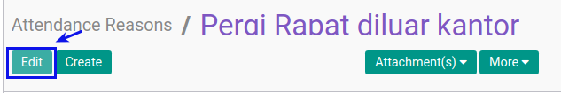

# Memodifikasi Attendance Reason

## A. INPUT

*(Tidak ada instruksi khusus)*

## B. LANGKAH KERJA

1. Buka menu **Human Resource -> Configuration -> Attendance -> Attendance Reason**. Abaikan jika sudah berada pada menu yang dimaksud.
2. Double klik pada data yang akan diedit
3. Klik tombol **Edit** pada bagian atas-kiri form.

4. Isi dan sesuaikan **[Reason](./penjelasan.md#field-name)**. Harus diisi.
5. Pilih dan sesuaikan **[Action Type](./penjelasan.md#field-action)**. Tidak harus diisi
6. Jika akan **disimpan** Klik tombol **Save** pada bagian atas-kiri form.

## C. OUTPUT

*(Tidak ada instruksi khusus)*
