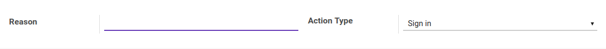

# Penjelasan Attendance Reason

### <a name="bagian-header">HEADER</a>

#### <a name="field-name">Reason</a>

Definisikan alasan kehadiran

#### <a name="field-action">Action Type</a>

Definisikan jenis alasan kehadiran tersebut
