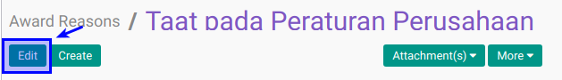

# Memodifikasi Award Reason

## A. INPUT

*(Tidak ada instruksi khusus)*

## B. LANGKAH KERJA

1. Buka menu **Human Resource -> Configuration -> Career Administration -> Award Reason**. Abaikan jika sudah berada pada menu yang dimaksud.
2. Double klik pada data yang akan diedit
3. Klik tombol **Edit** pada bagian atas-kiri form.

6
4. Isi dan sesuaikan **[Award Reason](./penjelasan.md#field-name)** jika diperlukan. Harus diisi.
5. Isi dan sesuaikan **[Code](./penjelasan.md#field-code)** jika diperlukan. Tidak harus diisi
6. Pilih dan sesuaikan **[Award Type](./penjelasan.md#field-award-type)** jika diperlukan. Tidak harus diisi
7. Aktif dan sesuaikan  **[Active](./penjelasan.md#field-active)** jika dibutuhkan.
8. Buka **Tab Note**
9. Isi dan sesuaikan **[Note](./penjelasan.md#field-note)** jika diperlukan. Tidak harus diisi
10. Jika akan **disimpan** Klik tombol **Save** pada bagian atas-kiri form.

## C. OUTPUT

*(Tidak ada instruksi khusus)*
