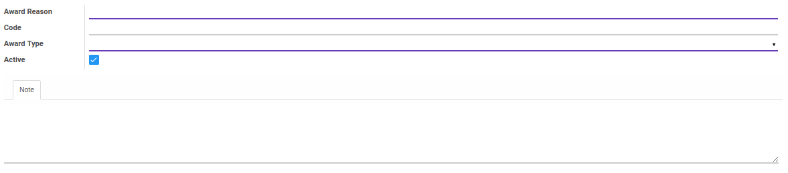

# Penjelasan

### <a name="bagian-header">HEADER</a>

#### <a name="field-name">Award Reason</a>

Nama alasan penghargaan

#### <a name="field-code">Code</a>

Kode jenis penghargaan

#### <a name="field-award-type">Award Type</a>

Mendefinisikan jenis penghargaan

#### <a name="field-active">Active</a>

Sebagai penanda apakah data adalah aktif/non-aktif

#### <a name="field-note">Note</a>

Catatan tambahan terkait tipe penghargaan
