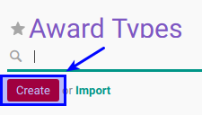

# Membuat Award Type

## A. INPUT

*(Tidak ada instruksi khusus)*

## B. LANGKAH KERJA

1. Buka menu **Human Resource -> Configuration -> Career Administration -> Award Type**. Abaikan jika sudah berada pada menu yang dimaksud.
2. Klik tombol **Create** pada bagian atas-kiri form.

3. Isi **[Award Type](./penjelasan.md#field-name)**. Harus diisi.
4. Isi **[Code](./penjelasan.md#field-code)**. Tidak harus diisi
5. Aktifkan **[Active](./penjelasan.md#field-active)** jika dibutuhkan.
6. Pilih **[Sequence](./penjelasan.md#field-sequence)**. Tidak harus diisi.
7. Buka **Tab Policies**
8. Pilih **[Allowed To Confirm Employee Award](./penjelasan.md#field-allowed-confirm)**. Tidak harus diisi.
9. Pilih **[Allowed To Approve Employee Award](./penjelasan.md#field-allowed-approve)**. Tidak harus diisi.
10. Pilih **[Allowed To Open Employee Award](./penjelasan.md#field-allowed-open)**. Tidak harus diisi.
11. Pilih **[Allowed To Finish Employee Award](./penjelasan.md#field-allowed-finish)**. Tidak harus diisi.
12. Pilih **[Allowed To Cancel Employee Award](./penjelasan.md#field-allowed-cancel)**. Tidak harus diisi.
13. Pilih **[Allowed To Restart Employee Award](./penjelasan.md#field-allowed-restart)**. Tidak harus diisi.
14. Buka **Tab Note**
15. Isi **[Note](./penjelasan.md#field-note)**. Tidak harus diisi
16. Jika akan **disimpan** Klik tombol **Save** pada bagian atas-kiri form.

## C. OUTPUT

*(Tidak ada instruksi khusus)*
