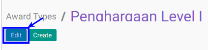

# Memodifikasi Award Type

## A. INPUT

*(Tidak ada instruksi khusus)*

## B. LANGKAH KERJA

1. Buka menu **Human Resource -> Configuration -> Career Administration -> Award Type**. Abaikan jika sudah berada pada menu yang dimaksud.
2. Double klik pada data yang akan diedit
3. Klik tombol **Edit** pada bagian atas-kiri form.

4. Isi dan sesuaikan **[Award Type](./penjelasan.md#field-name)**. Harus diisi.
5. Isi dan sesuaikan **[Code](./penjelasan.md#field-code)**. Tidak harus diisi
6. Aktif dan sesuaikan  **[Active](./penjelasan.md#field-active)** jika dibutuhkan.
7. Pilih dan sesuaikan **[Sequence](./penjelasan.md#field-sequence)**. Tidak harus diisi.
8. Buka **Tab Policies**
9. Pilih dan sesuaikan **[Allowed To Confirm Employee Award](./penjelasan.md#field-allowed-confirm)**. Tidak harus diisi.
10. Pilih dan sesuaikan **[Allowed To Approve Employee Award](./penjelasan.md#field-allowed-approve)**. Tidak harus diisi.
11. Pilih dan sesuaikan **[Allowed To Open Employee Award](./penjelasan.md#field-allowed-open)**. Tidak harus diisi.
12. Pilih dan sesuaikan **[Allowed To Finish Employee Award](./penjelasan.md#field-allowed-finish)**. Tidak harus diisi.
13. Pilih dan sesuaikan **[Allowed To Cancel Employee Award](./penjelasan.md#field-allowed-cancel)**. Tidak harus diisi.
14. Pilih dan sesuaikan **[Allowed To Restart Employee Award](./penjelasan.md#field-allowed-restart)**. Tidak harus diisi.
15. Buka **Tab Note**
16. Isi dan sesuaikan **[Note](./penjelasan.md#field-note)**. Tidak harus diisi
17. Jika akan **disimpan** Klik tombol **Save** pada bagian atas-kiri form.

## C. OUTPUT

*(Tidak ada instruksi khusus)*
