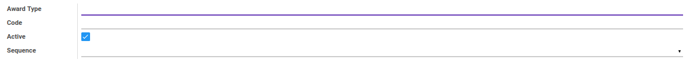
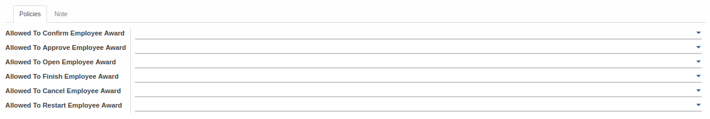
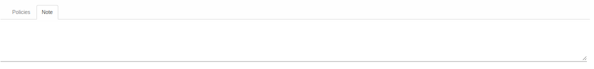

# Penjelasan

Informasi pada Award Type dibagi menjadi beberapa area, diantaranya:

* [Header](#bagian-header)
* [Tab Policies](#tab-policies)
* [Tab Note](#tab-note)

### <a name="bagian-header">HEADER</a>

#### <a name="field-name">Award Type</a>

Nama jenis penghargaan

#### <a name="field-code">Code</a>

Kode jenis penghargaan

#### <a name="field-active">Active</a>

Sebagai penanda apakah data adalah aktif/non-aktif

#### <a name="field-sequence">Sequence</a>

Mendefinisikan kode sequence
> **Catatan:** Sequence yang dipilih nantinya akan mempengaruhi pemberian nomor pada data *Employee Award* ketika dibuat

### <a name="tab-policies">TAB POLICIES</a>

#### <a name="field-allowed-confirm">Allowed To Confirm Employee Award</a>

Mendefinisikan group yang diperbolehkan untuk melakukan *Confirm* pada data *Employee Award*

#### <a name="field-allowed-approve">Allowed To Approve Employee Award</a>

Mendefinisikan group yang diperbolehkan untuk melakukan *Approve* pada data *Employee Award*

#### <a name="field-allowed-open">Allowed To Open Employee Award</a>

Mendefinisikan group yang diperbolehkan untuk melakukan *Open* pada data *Employee Award*

#### <a name="field-allowed-finish">Allowed To Finish Employee Award</a>

Mendefinisikan group yang diperbolehkan untuk melakukan *Finish* pada data *Employee Award*

#### <a name="field-allowed-cancel">Allowed To Cancel Employee Award</a>

Mendefinisikan group yang diperbolehkan untuk melakukan *Cancel* pada data *Employee Award*

#### <a name="field-allowed-restart">Allowed To Restart Employee Award</a>

Mendefinisikan group yang diperbolehkan untuk melakukan *Restart* pada data *Employee Award*

### <a name="tab-note">TAB NOTE</a>

#### <a name="field-note">Note</a>

Catatan tambahan terkait tipe penghargaan