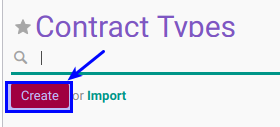

# Membuat Contract Types

## A. INPUT

*(Tidak ada instruksi khusus)*

## B. LANGKAH KERJA

1. Buka menu **Human Resource -> Configuration -> Contract -> Contract Types**. Abaikan jika sudah berada pada menu yang dimaksud.
2. Klik tombol **Create** pada bagian atas-kiri form.

3. Isi **[Contract Type](./penjelasan.md#field-year)**. Harus diisi.
4. Jika akan **disimpan** Klik tombol **Save** pada bagian atas-kiri form.

## C. OUTPUT

*(Tidak ada instruksi khusus)*
