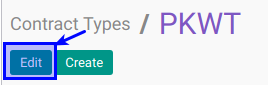

# Memodifikasi Contract Types

## A. INPUT

*(Tidak ada instruksi khusus)*

## B. LANGKAH KERJA

1. Buka menu **Human Resource -> Configuration -> Contract -> Contract Types**. Abaikan jika sudah berada pada menu yang dimaksud.
2. Double klik pada data yang akan diedit.
3. Klik tombol **Edit** pada bagian atas-kiri form.

4. Isi **[Contract Type](./penjelasan.md#field-year)**. Harus diisi.
5. Jika akan **disimpan** Klik tombol **Save** pada bagian atas-kiri form.

## C. OUTPUT

*(Tidak ada instruksi khusus)*
