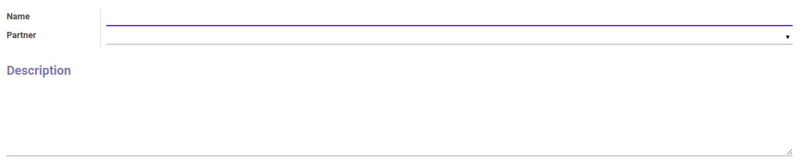

# Penjelasan

### <a name="bagian-header">HEADER</a>

#### <a name="field-name">Name</a>

Nama contribution register

#### <a name="field-partner-id">Partner</a>

Mendefinisikan partner

#### <a name="field-description">Description</a>

Catatan/deskripsi mengenai contribution register
