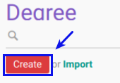

# Membuat Degrees

## A. INPUT

*(Tidak ada instruksi khusus)*

## B. LANGKAH KERJA

1. Buka menu **Human Resource -> Configuration -> Recruitment -> Degrees**. Abaikan jika sudah berada pada menu yang dimaksud.
2. Klik tombol **Create** pada bagian atas-kiri form.

3. Isi **[Name](./penjelasan.md#field-name)**. Harus diisi.
4. Isi **[Sequence](./penjelasan.md#field-sequence)**. Tidak Harus diisi.
5. Jika akan **disimpan** Klik tombol **Save** pada bagian atas-kiri form.

## C. OUTPUT

*(Tidak ada instruksi khusus)*
