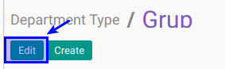

# Memodifikasi Department Type

## A. INPUT

*(Tidak ada instruksi khusus)*

## B. LANGKAH KERJA

1. Buka menu **Human Resource -> Configuration -> Department Type**. Abaikan jika sudah berada pada menu yang dimaksud.
2. Double klik pada data yang akan diedit
3. Klik tombol **Edit** pada bagian atas-kiri form.

4. Isi dan sesuaikan **[Name](./penjelasan.md#field-name)** jika diperlukan. Harus diisi.
5. Isi dan sesuaikan **[Description](./penjelasan.md#field-description)** jika diperlukan. Tidak harus diisi
6. Aktif dan sesuaikan **[Active](./penjelasan.md#field-active)** jika dibutuhkan.
7. Jika akan **disimpan** Klik tombol **Save** pada bagian atas-kiri form.

## C. OUTPUT

*(Tidak ada instruksi khusus)*
