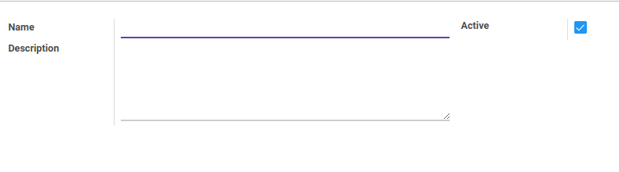

# Penjelasan

### <a name="bagian-header">HEADER</a>

#### <a name="field-name">Name</a>

Nama tipe departemen

#### <a name="field-description">Deskripsi</a>

Deskripsi mengenai tipe departemen

#### <a name="field-active">Active</a>

Sebagai penanda apakah data adalah aktif/non-aktif
