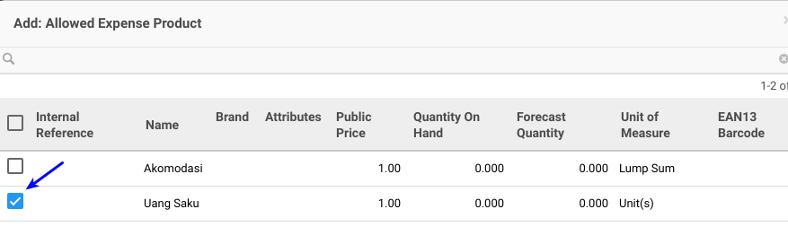

# Membuat Allowed Expense Product

Allowed Expense Product **diinput** jika ada expense product yang dapat diberikan

*(Instruksi kerja ini merupakan sub instruksi dari (1) [Membuat Department](./membuat.md), atau (2) [Memodifikasi Department](./memodifikasi.md). Instruksi kerja ini tidak bisa berdiri sendiri)*

## A. INPUT

*(Tidak ada prasyarat khusus)*

## B. INSTRUKSI KERJA

1. Buka tab **Allowed Expense Product**.
2. <a name="l2">Klik</a> tombol **Add an Item** pada tabel **Allowed Expense Product**.

3. Pilih **[Name](./penjelasan.md#bagian-all-allowed-expense-product)**. Centang product yang diperbolehkan.

4. Klik Select pada bagian bawah kiri jika ada product yang dipilih.

5. Ulangi [langkah ke-2](#l2) untuk setiap allowed expense product yang akan ditambahkan.
6. Lanjutkan [langkah ke-8 instruksi Membuat Department](./membuat.md#l8) atau [langkah ke-9 instruksi Memodifikasi Department](./memodifikasi.md#l9).

## C. OUTPUT

*(Tidak ada instruksi khusus)*
