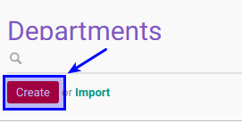

# Membuat Department

## A. INPUT

*(Tidak ada instruksi khusus)*

## B. LANGKAH KERJA

1. Buka menu **Human Resource -> Configuration -> Department**. Abaikan jika sudah berada pada menu yang dimaksud.
2. Klik tombol **Create** pada bagian atas-kiri form.

3. Isi **[Department Name](./penjelasan.md#field-name)**. Harus diisi.
4. Pilih **[Manager](./penjelasan.md#field-manager-id)**. Tidak harus diisi
5. Pilih **[Parent Department](./penjelasan.md#field-parent-id)**. Tidak harus diisi
6. Pilih **[Training Allowance Pricelist](./penjelasan.md#field-pricelist)**. Tidak harus diisi. Jika module training diinstall
7. Buka **Tab Allowed Expense Product Categories**
8. <a name="l8">[Tambahkan](./membuat-allowed-product-categories.md)/[Hapus](./menghapus-allowed-product-categories.md)</a>  **Allowed Expense Product Categories**.
9. Buka **Tab Allowed Expense Product**
10. <a name="l10">[Tambahkan](./membuat-expense-product.md)/[Hapus](./menghapus-expense-product.md)</a>  **Allowed Expense Product**.
11. Buka **Tab All Allowed Expense Product**
12. Jika akan **disimpan** Klik tombol **Save** pada bagian atas-kiri form.

## C. OUTPUT

*(Tidak ada instruksi khusus)*
