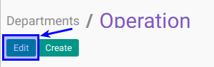
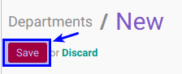

# Memodifikasi Department

## A. INPUT

*(Tidak ada instruksi khusus)*

## B. LANGKAH KERJA

1. Buka menu **Human Resource -> Configuration -> Department**. Abaikan jika sudah berada pada menu yang dimaksud.
2. Double klik pada data yang akan diedit
3. Klik tombol **Edit** pada bagian atas-kiri form.

4. Isi dan sesuaikan **[Department Name](./penjelasan.md#field-name)** jika diperlukan. Harus diisi.
5. Pilih dan sesuaikan **[Manager](./penjelasan.md#field-manager-id)** jika diperlukan. Tidak harus diisi
6. Pilih dan sesuaikan **[Parent Department](./penjelasan.md#field-parent-id)** jika diperlukan. Tidak harus diisi
7. Pilih dan sesuaikan **[Training Allowance Pricelist](./penjelasan.md#field-pricelist)** jika diperlukan. Tidak harus diisi. Jika module training diinstall
8. Buka **Tab Allowed Expense Product Categories**
9. <a name="l9">[Tambahkan](./membuat-allowed-product-categories.md)/[Modifikasi](./memodifikasi-allowed-product-categories.md)/[Hapus](./menghapus-allowed-product-categories.md)</a>  **Allowed Expense Product Categories**.
10. Buka **Tab Allowed Expense Product**
11. <a name="l11">[Tambahkan](./membuat-expense-product.md)/[Modifikasi](./memodifikasi-expense-product.md)/[Hapus](./menghapus-expense-product.md)</a>  **Allowed Expense Product**.
12. Buka **Tab All Allowed Expense Product**
13. Jika akan **disimpan** Klik tombol **Save** pada bagian atas-kiri form.

## C. OUTPUT

*(Tidak ada instruksi khusus)*
