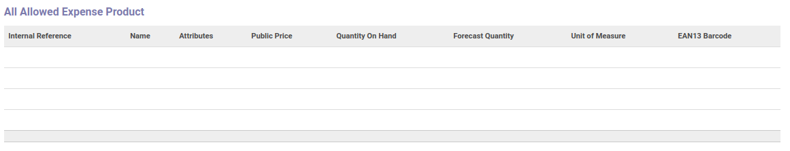

# Penjelasan

Informasi pada *department* dibagi menjadi 4 (empat) bagian, yaitu:

* [Header](#bagian-header)
* [Training Allowance Pricelist](#field-pricelist) jika module training *diinstal*
* [Allowed Expense Product Categories](#bagian-allowed-expense-product-categories)
* [Allowed Expense Product](#bagian-allowed-expense-product)
* [Allowed Expense Product](#bagian-all-allowed-expense-product)

### <a name="bagian-header">HEADER</a>

#### <a name="field-name">Department Name</a>

Nama departemen

#### <a name="field-parent-id">Parent Department</a>

Parent/Induk dari departemen

#### <a name="field-pricelist">Training Allowance Pricelist</a>
>**Catatan:** Isian ini hanya muncul jika module training *diinstall*

Pricelist yang dipakai untuk allowance

#### <a name="field-manager-id">Manager</a>

Mendefinisikan manajer dari departemen

### <a name="bagian-allowed-expense-product-categories">Allowed Expense Product Categories</a>

Mendefiniskan kategori produk yang diperbolehkan

### <a name="bagian-allowed-expense-product">Allowed Expense Product</a>

Mendefiniskan produk yang diperbolehkan

### <a name="bagian-all-allowed-expense-product">All Allowed Expense Product</a>

Informasi mengenai semua produk yang diperbolehkan termasuk produk-produk yang memiliki kategori yang sudah didefinisikan pada isian **Allowed Expense Product Categories** diatas
