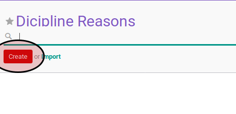

# Membuat Dicipline Reason

1. Buka menu **Human Resource -> Configuration -> Career Administration -> Dicipline Reason**
2. Klik tombol **Create** pada bagian atas-kiri form

3. Isi **[Dicipline Reason](../dicipline-reason.md#field-effective-date)**. Harus diisi.
4. Isi **[Code](../dicipline-reason.md#field-code)**. Harus diisi.
5. Biarkan field **Active** dalam keadan aktif.
6. Isi **[Dicipline Type](../dicipline-reason.md#field-dicipline-type)**. Harus diisi.
7. Buka tab **Note**
8. Isi **[Note](../dicipline-reason.md#field-note)**. Tidak harus diisi.
9. Klik tombol **Save** pada bagian atas-kiri form.

