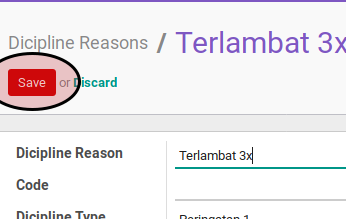

# Membuat Dicipline Reason

## A. INPUT

*(Tidak ada instruksi khusus)*

## B. LANGKAH KERJA

1. Buka menu **Human Resource -> Configuration -> Career Administration -> Dicipline Reason**. Abaikan jika sudah berada pada menu yang dimaksud.
2. Klik tombol **Create** pada bagian atas-kiri form.

3. Isi **[Dicipline Reason](./penjelasan.md#field-dicipline-reason)**. Harus diisi.
4. Isi **[Code](./penjelasan.md#field-code)**. Tidak harus diisi
5. Pilih **[Dicipline Type](./penjelasan.md#field-dicipline-type)**. Tidak harus diisi
6. Aktifkan **[Active](./penjelasan.md#field-active)** jika dibutuhkan.
7. Buka **Tab Note**
8. Isi **[Note](./penjelasan.md#field-note)**. Tidak harus diisi
9. Jika akan **disimpan** Klik tombol **Save** pada bagian atas-kiri form.

## C. OUTPUT

*(Tidak ada instruksi khusus)*
