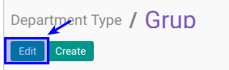
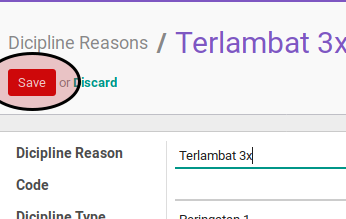

# Memodifikasi Dicipline Reason

## A. INPUT

*(Tidak ada instruksi khusus)*

## B. LANGKAH KERJA

1. Buka menu **Human Resource -> Configuration -> Career Administration -> Dicipline Reason**. Abaikan jika sudah berada pada menu yang dimaksud.
2. Double klik pada data yang akan diedit
3. Klik tombol **Edit** pada bagian atas-kiri form.

4. Isi dan sesuaikan **[Dicipline Reason](./penjelasan.md#field-dicipline-reason)**. Harus diisi.
5. Isi dan sesuaikan **[Code](./penjelasan.md#field-code)**. Tidak harus diisi
6. Pilih dan sesuaikan **[Dicipline Type](./penjelasan.md#field-dicipline-type)**. Tidak harus diisi
7. Aktifkan dan sesuaikan **[Active](./penjelasan.md#field-active)** jika dibutuhkan.
8. Buka **Tab Note**
9. Isi dan sesuaikan **[Note](./penjelasan.md#field-note)**. Tidak harus diisi
10. Jika akan **disimpan** Klik tombol **Save** pada bagian atas-kiri form.

## C. OUTPUT

*(Tidak ada instruksi khusus)*
