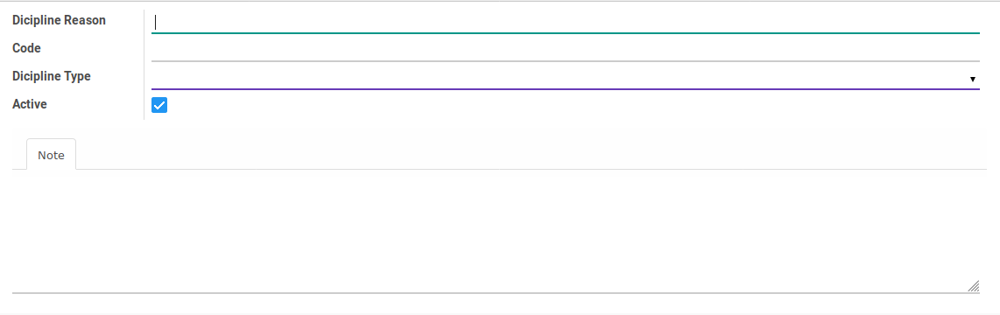

# Penjelasan

#### <a name="field-dicipline-reason">Dicipline Reason</a>

Alasan pemberian sanksi karyawan

#### <a name="field-code">Code</a>

Kode alasan pemberian sanksi karyawan

#### <a name="field-dicipline-type">Dicipline Type</a>

Tipe sanksi yang diperbolehkan untuk menggunakan alasan

#### <a name="field-active">Active</a>

#TODO

#### Note

Keterangan tambahan terkait alasan pemberian sanksi
