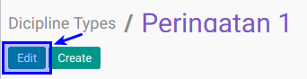
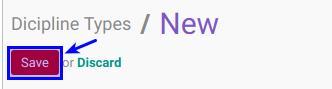

# Memodifikasi Dicipline Type

## A. INPUT

*(Tidak ada instruksi khusus)*

## B. LANGKAH KERJA

1. Buka menu **Human Resource -> Configuration -> Career Administration -> Dicipline Type**. Abaikan jika sudah berada pada menu yang dimaksud.
2. Double klik pada data yang akan diedit
3. Klik tombol **Edit** pada bagian atas-kiri form.

4. Isi dan sesuaikan **[Dicipline Type](./penjelasan.md#field-name)** jika dibutuhkan. Harus diisi.
5. Isi dan sesuaikan **[Code](./penjelasan.md#field-code)** jika dibutuhkan. Tidak harus diisi
6. Aktifkan dan sesuaikan  **[Active](./penjelasan.md#field-active)** jika dibutuhkan.
7. Pilih dan sesuaikan **[Sequence](./penjelasan.md#field-sequence)** jika dibutuhkan. Tidak harus diisi.
8. Buka **Tab Fine**
9. Pilih dan sesuaikan **[Journal](./penjelasan.md#field-journal)** jika dibutuhkan. Tidak harus diisi.
10. Pilih dan sesuaikan **[Receivable Account](./penjelasan.md#field-receivable-account)** jika dibutuhkan. Tidak harus diisi.
11. Pilih dan sesuaikan **[Income Account](./penjelasan.md#field-income-account)** jika dibutuhkan. Tidak harus diisi.
12. Buka **Tab Policies**
13. Pilih dan sesuaikan **[Allowed To Confirm Employee Dicipline](./penjelasan.md#field-allowed-confirm)** jika dibutuhkan. Tidak harus diisi.
14. Pilih dan sesuaikan **[Allowed To Approve Employee Dicipline](./penjelasan.md#field-allowed-approve)** jika dibutuhkan. Tidak harus diisi.
15. Pilih dan sesuaikan **[Allowed To Open Employee Dicipline](./penjelasan.md#field-allowed-open)** jika dibutuhkan. Tidak harus diisi.
16. Pilih dan sesuaikan **[Allowed To Finish Employee Dicipline](./penjelasan.md#field-allowed-finish)** jika dibutuhkan. Tidak harus diisi.
17. Pilih dan sesuaikan **[Allowed To Cancel Employee Dicipline](./penjelasan.md#field-allowed-cancel)** jika dibutuhkan. Tidak harus diisi.
18. Pilih dan sesuaikan **[Allowed To Restart Employee Dicipline](./penjelasan.md#field-allowed-restart)** jika dibutuhkan. Tidak harus diisi.
19. Buka **Tab Note**
20. Isi dan sesuaikan **[Note](./penjelasan.md#field-note)** jika dibutuhkan. Tidak harus diisi
21. Jika akan **disimpan** Klik tombol **Save** pada bagian atas-kiri form.

## C. OUTPUT

*(Tidak ada instruksi khusus)*
