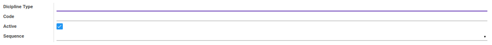
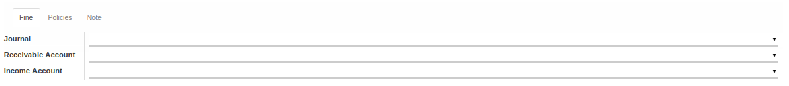
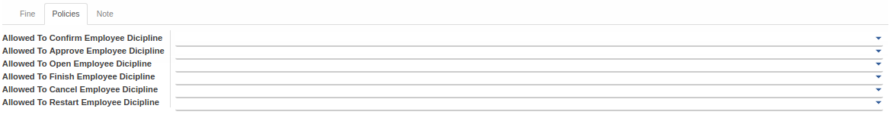

# Penjelasan

Informasi pada Dicipline Type dibagi menjadi beberapa area, diantaranya:

* [Header](#bagian-header)
* [Tab Fine](#tab-fine)
* [Tab Policies](#tab-policies)
* [Tab Note](#tab-note)

### <a name="bagian-header">HEADER</a>

#### <a name="field-name">Dicipline Type</a>

Nama jenis disiplin

#### <a name="field-code">Code</a>

Kode jenis disiplin

#### <a name="field-active">Active</a>

Sebagai penanda apakah data adalah aktif/non-aktif

#### <a name="field-sequence">Sequence</a>

Mendefinisikan kode sequence
> **Catatan:** Sequence yang dipilih nantinya akan mempengaruhi pemberian nomor pada data *Employee Diciplines* ketika dibuat

### <a name="tab-fine">TAB FINE (DENDA)</a>

#### <a name="field-journal">Journal</a>

Mendefinisikan jurnal yang akan digunakan

#### <a name="field-receivable-account">Receivable Account</a>

Mendefinisikan akun piutang yang akan digunakan

#### <a name="field-income-account">Income Account</a>

Mendefinisikan akun pendapatan yang akan digunakan

### <a name="tab-policies">TAB POLICIES</a>

#### <a name="field-allowed-confirm">Allowed To Confirm Employee Dicipline</a>

Mendefinisikan group yang diperbolehkan untuk melakukan *Confirm* pada data *Employee Diciplines*

#### <a name="field-allowed-approve">Allowed To Approve Employee Dicipline</a>

Mendefinisikan group yang diperbolehkan untuk melakukan *Approve* pada data *Employee Diciplines*

#### <a name="field-allowed-open">Allowed To Open Employee Dicipline</a>

Mendefinisikan group yang diperbolehkan untuk melakukan *Open* pada data *Employee Diciplines*

#### <a name="field-allowed-finish">Allowed To Finish Employee Dicipline</a>

Mendefinisikan group yang diperbolehkan untuk melakukan *Finish* pada data *Employee Diciplines*

#### <a name="field-allowed-cancel">Allowed To Cancel Employee Dicipline</a>

Mendefinisikan group yang diperbolehkan untuk melakukan *Cancel* pada data *Employee Diciplines*

#### <a name="field-allowed-restart">Allowed To Restart Employee Dicipline</a>

Mendefinisikan group yang diperbolehkan untuk melakukan *Restart* pada data *Employee Diciplines*

### <a name="tab-note">TAB NOTE</a>

#### <a name="field-note">Note</a>

Catatan tambahan terkait tipe penghargaan
