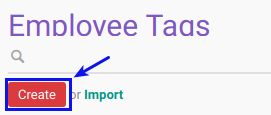

# Membuat Employee Tags

## A. INPUT

*(Tidak ada instruksi khusus)*

## B. LANGKAH KERJA

1. Buka menu **Human Resource -> Configuration -> Employee Tags**. Abaikan jika sudah berada pada menu yang dimaksud.
2. Klik tombol **Create** pada bagian atas-kiri form.

3. Isi **[Employee tags](./penjelasan.md#field-name)**. Harus diisi.
4. Pilih **[Parent Employee Tag](./penjelasan.md#field-description)**. Tidak Harus diisi.
5. Jika akan **disimpan** Klik tombol **Save** pada bagian atas-kiri form.

## C. OUTPUT

*(Tidak ada instruksi khusus)*
