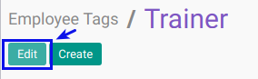

# Memodifikasi Employee Tags

## A. INPUT

*(Tidak ada instruksi khusus)*

## B. LANGKAH KERJA

1. Buka menu **Human Resource -> Configuration -> Employee Tags**. Abaikan jika sudah berada pada menu yang dimaksud.
2. Double klik pada data yang akan diedit
3. Klik tombol **Edit** pada bagian atas-kiri form.

4. Isi dan sesuaikan **[Employee tags](./penjelasan.md#field-name)**. Harus diisi.
5. Pilih dan sesuaikan **[Parent Employee Tag](./penjelasan.md#field-description)**. Tidak Harus diisi.
6. Jika akan **disimpan** Klik tombol **Save** pada bagian atas-kiri form.

## C. OUTPUT

*(Tidak ada instruksi khusus)*
