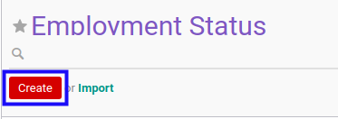

# Membuat Employment Status

## A. INPUT

*(Tidak ada instruksi khusus)*

## B. LANGKAH KERJA

1. Buka menu **Human Resources -> Configuration -> Employment Status**. Abaikan jika sudah berada pada menu yang dimaksud.
2. Klik tombol **Create** pada bagian atas-kiri form.

3. Isi **[Employment Status](./penjelasan.md#field-employment-status)**. Wajib diisi.
4. Isi **[Code](./penjelasan.md#field-code)**. Tidak wajib diisi.
5. Isi **[Sequence](./penjelasan.md#field-sequence)**. Tidak wajib diisi.
6. Aktifkan/ Deaktifkan **[Active](./penjelasan.md#field-active)**. Tidak wajib diisi.
7. Beralih ke tab **[Note](./penjelasan.md#tab-note)**.
8. Isi **[Note](./penjelasan.md#tab-note)**. Tidak wajib diisi.
9. Klik tombol **Save** pada bagian atas-kiri form.

## C. OUTPUT

*(Tidak ada instruksi khusus)*
