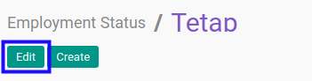

# Memodifikasi Employement Status

## A. INPUT

*(Tidak ada instruksi khusus)*

## B. LANGKAH KERJA

1. Buka menu **Human Resources -> Configuration -> Employment Status**. Abaikan jika sudah berada pada menu yang dimaksud.
2. Buka data *employment status* yang akan dimodifikasi. Abaikan jika data sudah dibuka.
3. Klik tombol **Edit** pada bagian atas-kiri form.

4. Isi dan sesuaikan **[Employment Status](./penjelasan.md#field-employment-status)** jika dibutuhkan. Wajib diisi.
5. Isi dan sesuaikan **[Code](./penjelasan.md#field-code)** jika dibutuhkan. Tidak wajib diisi.
6. Isi dan sesuaikan **[Sequence](./penjelasan.md#field-sequence)** jika dibutuhkan. Tidak wajib diisi.
7. Aktifkan/ Deaktifkan **[Active](./penjelasan.md#field-active)** jika dibutuhkan. Tidak wajib diisi.
8. Beralih ke tab **[Note](./penjelasan.md#tab-note)**.
9. Isi dan sesuaikan **[Note](./penjelasan.md#tab-note)** jika dibutuhkan. Tidak wajib diisi.
10. Klik tombol **Save** pada bagian atas-kiri form.

## C. OUTPUT

* Data employment status akan berubah sesuai dengan perubahan yang dilakukan.
