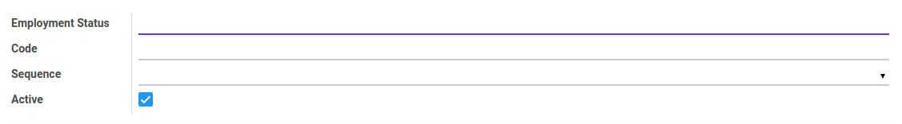
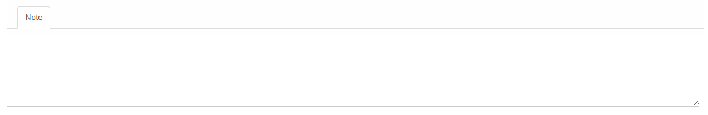

# Penjelasan Employement Status

Informasi pada *employment status* dibagi menjadi beberapa bagian, yaitu:

* [Header](#bagian-header)
* [Tab Note](#tab-note)

### <a name="bagian-header">HEADER</a>

#### <a name="field-employment-status">Employment Status</a>

Status employee.

#### <a name="field-code">Code</a>

*to-do*.

#### <a name="field-sequence">Sequence</a>

Sequence penomoran karyawan.

#### <a name="field-active">Active</a>

Penanda employment status aktif.

### <a name="tab-note">NOTE</a>

Catatan tambahan.
