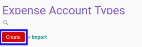

# Membuat Expense Account Type

## A. INPUT

*(Tidak ada instruksi khusus)*

## B. LANGKAH KERJA

1. Buka menu **Human Resources -> Configuration -> Expense Account -> Types**. Abaikan jika sudah berada pada menu yang dimaksud.
2. Klik tombol **Create** pada bagian atas-kiri form.

3. Isi **[Expense Account Type](./penjelasan.md#field-expense-account-type)**. Wajib diisi.
4. Isi **[Code](./penjelasan.md#field-code)**. Wajib diisi.
5. Pilih **[Account](./penjelasan.md#field-account)**. Wajib diisi.
6. Pilih **[Sequence](./penjelasan.md#field-sequence)**. Tidak wajib diisi.
7. Beralih ke tab **[Workflow Policy](./penjelasan.md#tab-workflow-policy)**.
8. Pilih **[Allow To Confirm](./penjelasan.md#field-allow-confirm)**. Tidak wajib diisi.
9. Pilih **[Allow To Restart](./penjelasan.md#field-allow-restart)**. Tidak wajib diisi.
10. Pilih **[Allow To Cancel](./penjelasan.md#field-allow-cancel)**. Tidak wajib diisi.
11. Pilih **[Allow To Terminate](./penjelasan.md#field-allow-terminate)**. Tidak wajib diisi.
12. Beralih ke tab **[Note](./penjelasan.md#tab-note)**.
13. Isi **[Note](./penjelasan.md#field-note)**. Tidak wajib diisi.
14. Klik tombol **Save** pada bagian atas-kiri form.

## C. OUTPUT

*(Tidak ada instruksi khusus)*
