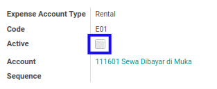
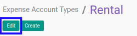

# Mengaktifkan Expense Account Type

## A. INPUT

* Data *Expense Account Type* yang akan diaktifkan harus memiliki status **Non Active**

## B. LANGKAH KERJA

1. Buka menu **Human Resources -> Configuration -> Expense Account -> Types**. Abaikan jika sudah berada pada menu yang dimaksud.
2. Buka data *Expense Account Type* yang akan diaktifkan. Abaikan jika data sudah dibuka.
3. Klik tombol **Edit** pada bagian atas-kiri form.

4. Aktifkan **[Active](./penjelasan.md#field-active)**.
5. Klik tombol **Save** pada bagian atas-kiri form.

## C. OUTPUT

* Data *Expense Account Type* akan aktif.
