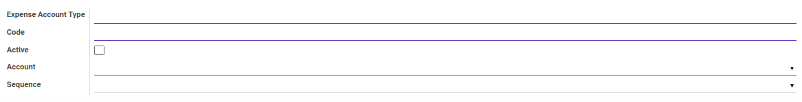
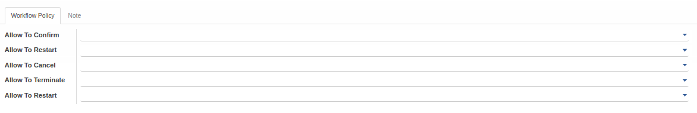
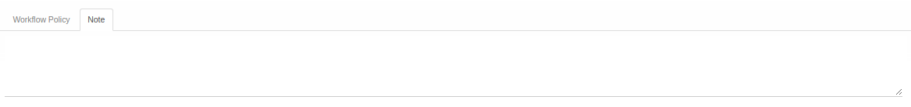

# Penjelasan Expense Account Type

Informasi pada *Expense Account Type* dibagi menjadi beberapa bagian, yaitu:

* [Header](#bagian-header)
* [Tab Workflow Policy](#tab-workflow-policy)
* [Tab Note](#tab-note)

### <a name="bagian-header">HEADER</a>

#### <a name="field-expense-account-type">Expense Account Type</a>

Tipe Akun Pengeluaran.

#### <a name="field-code">Code</a>

Kode Tipe Akun Pengeluaran.

#### <a name="field-active">Active</a>

Penanda status tipe akun pengeluaran aktif.

#### <a name="field-account">Account</a>

Nama Akun yang digunakan.

#### <a name="field-sequence">Sequence</a>

Nomor Urut.

#### <a name="tab-workflow-policy">TAB WORKFLOW POLICY</a>

#### <a name="field-allow-confirm">Allow To Confirm</a>

Berhak/tidaknya user untuk dapat mengkonfirmasi tipe akun pengeluaran.

#### <a name="field-allow-restart">Allow To Restart</a>

Berhak/tidaknya user untuk dapat menrestart tipe akun pengeluaran.

#### <a name="field-allow-cancel">Allow To Cancel</a>

Berhak/tidaknya user untuk dapat membatalkan tipe akun pengeluaran.

#### <a name="field-allow-terminate">Allow To Terminate</a>

Berhak/tidaknya user untuk dapat mengakhiri tipe akun pengeluaran.

#### <a name="tab-note">TAB NOTE</a>

#### <a name="field-note">Note</a>

Catatan.
