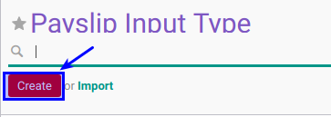

# Membuat Input Type

## A. INPUT

*(Tidak ada instruksi khusus)*

## B. LANGKAH KERJA

1. Buka menu **Human Resource -> Configuration -> Payroll -> Input Type**. Abaikan jika sudah berada pada menu yang dimaksud.
2. Klik tombol **Create** pada bagian atas-kiri form.

3. Isi **[Code](./penjelasan.md#field-code)**. Harus diisi.
4. Isi **[Input Type](./penjelasan.md#field-name)**. Harus diisi.
5. Aktifkan **[Active](./penjelasan.md#field-active)** jika dibutuhkan.
6. Isi **[Description](./penjelasan.md#field-description)**. Tidak Harus diisi.
7. Jika akan **disimpan** Klik tombol **Save** pada bagian atas-kiri form.

## C. OUTPUT

*(Tidak ada instruksi khusus)*
