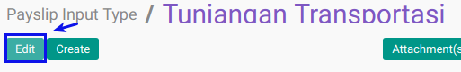

# Memodifikasi Input Type

## A. INPUT

*(Tidak ada instruksi khusus)*

## B. LANGKAH KERJA

1. Buka menu **Human Resource -> Configuration -> Payroll -> Input Type**. Abaikan jika sudah berada pada menu yang dimaksud.
2. Double klik pada data yang akan diedit
3. Klik tombol **Edit** pada bagian atas-kiri form.

4. Isi dan sesuiakan **[Code](./penjelasan.md#field-code)** jika dibutuhkan. Harus diisi.
5. Isi dan sesuiakan **[Input Type](./penjelasan.md#field-name)** jika dibutuhkan. Harus diisi.
6. Aktifkan **[Active](./penjelasan.md#field-active)** jika dibutuhkan.
7. Isi dan sesuiakan **[Description](./penjelasan.md#field-description)** jika dibutuhkan. Tidak Harus diisi.
8. Jika akan **disimpan** Klik tombol **Save** pada bagian atas-kiri form.

## C. OUTPUT

*(Tidak ada instruksi khusus)*
