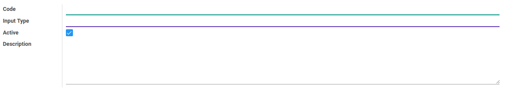

# Penjelasan

### <a name="bagian-header">HEADER</a>

#### <a name="field-code">Code</a>

Kode Input Type

#### <a name="field-name">Input Type</a>

Nama Input Type

#### <a name="field-active">Active</a>

Sebagai penanda apakah data adalah aktif/non-aktif

#### <a name="field-description">Description</a>

Catatan/deskripsi mengenai input type