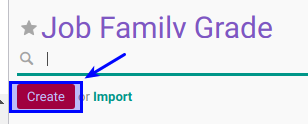

# Membuat Job Family Grade

## A. INPUT

## B. LANGKAH KERJA

1. Buka menu **Human Resource -> Configuration -> Job Family Modelling -> Job Family Grade**.
2. Klik tombol **Create** pada bagian atas-kiri form.

3. Isikan **[Job Family Grade](./penjelasan.md#field-name)**. Harus diisi.
4. Isikan **[Code](./penjelasan.md#field-code)**. Harus diisi.
5. Aktifkan **[Active](./penjelasan.md#field-active)** jika dibutuhkan.
6. Isi **[Note](./penjelasan.md#field-note)**. Pada **Tab Note**. Tidak harus diisi.
7. Jika ada allowance untuk paticipant maka lakukan [prosedur penginputan training allowance](./membuat-allowance.md).
8. Jika akan **disimpan** Klik tombol **Save** pada bagian atas-kiri form.

9. Jika **batal disimpan** Klik tombol **Discard** pada bagian atas-kiri form.

## C. OUTPUT
