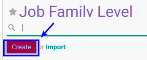

# Membuat Job Family Level

## A. INPUT

## B. LANGKAH KERJA

1. Buka menu **Human Resource -> Configuration -> Job Family Modelling -> Job Family Level**.

2. Klik tombol **Create** pada bagian atas-kiri form.

3. Piih **[Job Family Grade](./penjelasan.md#field-name)**. Harus diisi. Pilihan merupakan data Job Family Grade

4. Isikan **[Code](./penjelasan.md#field-code)**. Harus diisi.

5. Piih **[Job Family](./penjelasan.md#field-name)**. Harus diisi. Pilihan merupakan data Job Family

6. Pilih **[Min. Grade](./penjelasan.md#field-min-grade)**. Harus diisi. Pilihan merupakan data pada Job Grade

7. Pilih **[Max. Grade](./penjelasan.md#field-max-grade)**. Harus diisi. Pilihan merupakan data pada Job Grade

8. Aktifkan **[Active](./penjelasan.md#field-active)** jika dibutuhkan.

9. Isian **[Grade](./penjelasan.md#field-tab-job-grades)**. Pada **Tab Grade** akan terisi otomatis sesuai isian min dan max grade.

10. Isi **[Note](./penjelasan.md#field-note)**. Pada **Tab Note**. Tidak harus diisi.

11. Jika akan **disimpan** Klik tombol **Save** pada bagian atas-kiri form.

12. Jika **batal disimpan** Klik tombol **Discard** pada bagian atas-kiri form.

## C. OUTPUT
