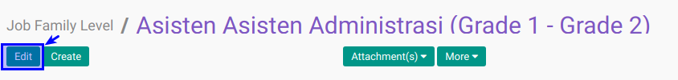

# Memodifikasi Job Family Level

## A. INPUT

*(Tidak ada instruksi khusus)*

## B. LANGKAH KERJA

1. Buka menu **Human Resource -> Configuration -> Job Family Modelling -> Job Family Level**. Abaikan jika sudah berada pada menu yang dimaksud.
2. Double klik pada data yang akan diedit. Abaikan jika data sudah dipilih.
3. Klik tombol **Edit** pada bagian atas-kiri form.

4. Piih **[Job Family Grade](./penjelasan.md#field-name)**. Harus diisi.
5. Isi dan sesuaikan **[Code](./penjelasan.md#field-code)**. Harus diisi.
6. Piih dan sesuaikan **[Job Family](./penjelasan.md#field-name)**. Harus diisi.
7. Pilih dan sesuaikan **[Min. Grade](./penjelasan.md#field-min-grade)**. Harus diisi.
8. Pilih dan sesuaikan **[Max. Grade](./penjelasan.md#field-max-grade)**. Harus diisi.
9. Aktifkan **[Active](./penjelasan.md#field-active)** jika dibutuhkan.
10. Buka **Tab Grade**
11. Isian **[Grade](./penjelasan.md#field-tab-job-grades)** pada **Tab Grade** merupakan isian nilai min dan max grade.
12. Buka **Tab Note**.
13. Isi dan sesuaikan **[Note](./penjelasan.md#field-note)**. Pada **Tab Note**. Tidak harus diisi.
14. Jika akan **disimpan** Klik tombol **Save** pada bagian atas-kiri form.

## C. OUTPUT

*(Tidak ada instruksi khusus)*
