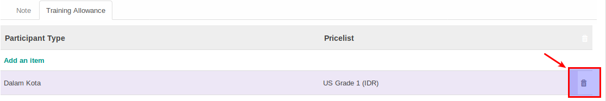

# Menghapus Training Allowance

## **Sub Menu ini digunakan jika module training *diinstall***

Training Allowance **diinput** jika ada pembayaran allowance kepada peserta training dimana besarannya diberikan berdasarkan *Job Family*

*(Instruksi kerja ini merupakan sub instruksi dari (1) [Membuat Job Family](./membuat.md), atau (2) [Memodifikasi Job Family](./memodifikasi.md). Instruksi kerja ini tidak bisa berdiri sendiri)*

## A. INPUT

*(Tidak ada prasyarat khusus)*

## B. INSTRUKSI KERJA

1. Buka tab **Training Allowance**.
2. <a name="l2">Pilih data </a>  **Training Allowance yang akan dihapus**.
3. Klik tombol gambar sampah yang ada di samping kanan data.

4. Ulangi [langkah ke-2](#l2) untuk setiap allowance yang akan dihapus.
5. Lanjutkan [langkah ke-13 intruksi Membuat Job Family](./membuat.md#l13) atau [langkah ke-14 instruksi Memodifikasi Job Family](./memodifikasi.md#l14).

## C. OUTPUT

* Data Training Allowance di Job Family akan terhapus.
