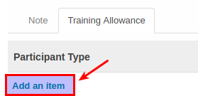

# Membuat Training Allowance

Dipakai jika module training *diinstall*

Data Training allowance **diinput** jika ada pembayaran allowance kepada peserta training dimana besarannya diberikan berdasarkan *Job Family*

1. Klik Tab **Training Allowance**.
2. Klik tombol **Add an Item** pada bagian atas-kiri tab.

3. Pilih **[Participant Type](./penjelasan.md#field-participant-type)**. Harus diisi.
4. Pilih **[Pricelist](./penjelasan.md#field-pricelist)**. Harus diisi.
