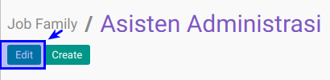

# Memodifikasi Job Family

## A. INPUT

*(Tidak ada instruksi khusus)*

## B. LANGKAH KERJA

1. Buka menu **Human Resource -> Configuration -> Job Family Modelling -> Job Family**. Abaikan jika sudah berada pada menu yang dimaksud.
2. Double klik pada data yang akan diedit
3. Klik tombol **Edit** pada bagian atas-kiri form.

4. Isi **[Job Family](./penjelasan.md#field-name)**. Harus diisi.
5. Isi **[Code](./penjelasan.md#field-code)**. Harus diisi.
6. Aktifkan **[Active](./penjelasan.md#field-active)** jika dibutuhkan.
7. Pilih **[Min. Grade](./penjelasan.md#field-min-grade)**. Harus diisi.
8. Pilih **[Max. Grade](./penjelasan.md#field-max-grade)**. Harus diisi.
9. Buka **Tab Grade**
10. Isian **[Grade](./penjelasan.md#field-tab-job-grades)** pada **Tab Grade** merupakan isian nilai min dan max grade.
11. Buka **Tab Note**.
12. Isi **[Note](./penjelasan.md#field-note)**. Tidak harus diisi.
13. Buka **Tab Training Allowance**
14. <a name="l14">[Tambahkan](./membuat-allowance.md)/[Modifikasi](./modifikasi-allowance.md)/[Hapus](./hapus-allowance.md)</a>  **Training Allowance**.
15. Jika akan **disimpan** Klik tombol **Save** pada bagian atas-kiri form.

## C. OUTPUT

*(Tidak ada instruksi khusus)*
