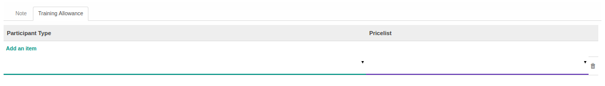

# Penjelasan

Informasi pada Job Family Grade dibagi menjadi beberapa area, diantaranya:

* [Header](#bagian-header)
* [Tab Job Grades](#tab-job-grades)
* [Tab Note](#tab-note)
* [Training Allowance](#tab-training-allowance) jika module training *diinstall*

### <a name="bagian-header">HEADER</a>

#### <a name="field-name">Job Family</a>

Nama job family

#### <a name="field-code">Code</a>

Kode job family

#### <a name="field-active">Active</a>

Sebagai penanda apakah data adalah aktif/non-aktif

#### <a name="field-min-grade">Min. Grade</a>

Mendefinisikan minimal grade

#### <a name="field-max-grade">Max. Grade</a>

Mendefinisikan maximal grade

### <a name="tab-job-grades">TAB JOB GRADES</a>

#### <a name="field-tab-job-grades">Job Grade</a>

Mendefinisikan job grade

### <a name="tab-note">TAB NOTE</a>

#### <a name="field-note">Note</a>

Catatan atau Keterangan

### <a name="tab-training-allowance">TAB TRAINING ALLOWANCE</a>

#### <a name="field-participant-type">Participant Type</a>

Tipe dari participant/peserta pelatihan

#### <a name="field-pricelist">Pricelist</a>

Pricelist yang dipakai untuk allowance
