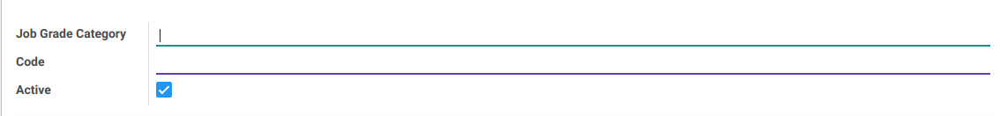
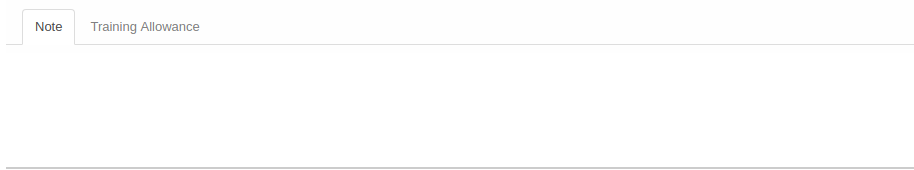
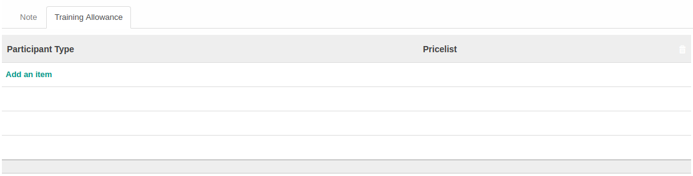

# Penjelasan

Informasi pada *job grade category* dibagi menjadi 3 (tiga) bagian, yaitu:

* [Header](#bagian-header)
* [Note](#tab-note)
* [Training Allowance](#tab-allowance) jika module training *diinstall*

## <a name="bagian-header">HEADER</a>

#### <a name="field-job-grade-category">Job Grade Category</a>

Nama Job Grade Category

#### <a name="field-code">Code</a>

Kode Job Grade Category

#### <a name="field-active">Active</a>

Status Job Grade Category (Aktif / Tidak)

## <a name="tab-note">TAB NOTE</a>

#### <a name="field-note">Note</a>

Catatan atau Keterangan Job Grade Category

## <a name="tab-allowance">TAB TRAINING ALLOWANCE</a> 

#### <a name="field-participant-type">Participant Type</a>

Tipe dari participant/peserta pelatihan

#### <a name="field-pricelist">Pricelist</a>

Pricelist yang dipakai untuk allowance
