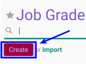

# Membuat Job Grade

## A. INPUT

## B. LANGKAH KERJA

1. Buka menu **Human Resource -> Configuration -> Job Family Modelling -> Job Grade**.

2. Klik tombol **Create** pada bagian atas-kiri form.

3. Isikan **[Job Grade](./penjelasan.md#field-name)**. Harus diisi.

4. Isikan **[Code](./penjelasan.md#field-code)**. Harus diisi.

5. Isikan **[Sequence](./penjelasan.md#field-sequence)**. Harus diisi.

6. Pilih **[Job Grade Category](./penjelasan.md#field-category-id)**. Isian merupakan input dari konfigurasi job grade category.

7. Aktifkan **[Active](./penjelasan.md#field-active)** jika dibutuhkan.

8. Isi **[Note](./penjelasan.md#field-note)**. Pada **Tab Note**. Tidak harus diisi.

9. Jika ada allowance untuk paticipant maka lakukan [prosedur penginputan training allowance](./membuat-allowance.md).

10. Jika akan **disimpan** Klik tombol **Save** pada bagian atas-kiri form.

11. Jika **batal disimpan** Klik tombol **Discard** pada bagian atas-kiri form.

## C. OUTPUT
