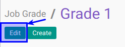

# Memodifikasi Job Grade

## A. INPUT

*(Tidak ada instruksi khusus)*

## B. LANGKAH KERJA

1. Buka menu **Human Resource -> Configuration -> Job Family Modelling -> Job Grade**. Abaikan jika sudah berada pada menu yang dimaksud.
2. Double klik pada data yang akan diedit
3. Klik tombol **Edit** pada bagian atas-kiri form.

4. Isi dan sesuaikan **[Job Grade](./penjelasan.md#field-name)**. Harus diisi.
5. Isi dan sesuaikan **[Code](./penjelasan.md#field-code)**. Harus diisi.
6. Isi dan sesuaikan **[Sequence](./penjelasan.md#field-sequence)**. Harus diisi.
7. Pilih dan sesuaikan **[Job Grade Category](./penjelasan.md#field-category-id)**. Isian merupakan input dari konfigurasi job grade category.
8. Aktifkan **[Active](./penjelasan.md#field-active)** jika dibutuhkan.
9. Buka **Tab Note**.
10. Isi dan sesuaikan **[Note](./penjelasan.md#field-note)**. Tidak harus diisi.
11. Buka **Tab Training Allowance**
12. <a name="l12">[Tambahkan](./membuat-allowance.md)/[Modifikasi](./modifikasi-allowance.md)/[Hapus](./hapus-allowance.md)</a>  **Training Allowance**.
13. Jika akan **disimpan** Klik tombol **Save** pada bagian atas-kiri form.

## C. OUTPUT

*(Tidak ada instruksi khusus)*
